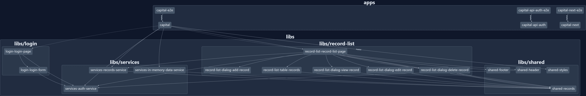

- [Nx Graph](#nx-graph)
- [Capital](#capital)
  - [Start the app](#start-the-app)
  - [About](#about)
    - [Tech stack](#tech-stack)
      - [Frontend](#frontend)
      - [Backend](#backend)
      - [Development](#development)
    - [Project Navigation](#project-navigation)
    - [Key functionality](#key-functionality)
    - [Project Notes](#project-notes)
  - [Generate code](#generate-code)
  - [Running tasks](#running-tasks)
  - [Want better Editor Integration?](#want-better-editor-integration)
  - [Ready to deploy?](#ready-to-deploy)
  - [Set up CI!](#set-up-ci)
  - [Connect with us!](#connect-with-us)

# Nx Graph



# Capital

<a alt="Nx logo" href="https://nx.dev" target="_blank" rel="noreferrer"></a>

✨ **This workspace has been generated by [Nx, a Smart, fast and extensible build system.](https://nx.dev)** ✨

## Start the app

To start both backend API and frontend app run `npm start`. Open your browser and navigate to http://localhost:4200/.

To start dep-graph run `npm dep-graph`. Open your browser and navigate to http://localhost:4211/projects/all?groupByFolder=true.

To build all project run `npm build`.

Happy coding!

## About

Login credentials:

- **`username: 'admin', password: 'admin'`** (role: 'admin')
- **`username: 'user', password: 'user'`** (role: 'user')

---

### Tech stack

#### Frontend

> Angular
>
> - NgRx store
> - Angular Material
> - SCSS

#### Backend

> NodeJs
>
> - Express
> - JwT

#### Development

> Nx
>
> - Monorepo
> - Jest
> - Cypress
> - ESLint
>
> VS Code
>
> Docker

---

### Project Navigation

The generated Nx graph is synced with the codebase of the project and should ease navigating the project. The npm command for starting a live interactive graph is `npm dep-graph`.

In the project root folder are located scripts for running multiple targets and in parallel. Nx console extension for VS Code is recommended.

---

### Key functionality

> - CRUD functions for managing a 'records' database.
> - Search, sort and filter 'records' entries.
> - Authentication and authorization for 'user'.

> - Angular module lazy loading
> - NgRx 'forFeature'
> - Routing 'forChild'
> - Globally available SASS variables/functions
> - Basic form validation

---

### Project Notes

**db.json.ts** : Contains the generator schema used to generate the records database via https://json-generator.com/

**db.json** : Contains the mock database generated. The file is served online at https://my-json-server.typicode.com/mppanayotov/Immedis_front_end_internship_2022_hcm_milen_panayotov/. This is the path the app uses when fetching records' data in `records.service.ts`. API responds but does not mutate the existing database. (Since the existing database is not being mutated, you will get error on update/delete a newly added entry.)

**records.service.ts** : Service that handles records' data traffic both for the online API and the NgRx Store.

**auth.service.ts** : Service that is responsible for user's authentication and authorization status. This service handles user's permissions regarding route navigation, localstorage information and communicating with the local backed API.

**apps/capital-api/src/main.ts** : Provides basic backend functions. Database is string array. Signs and verifies JwT tokens. Returns user role which is used to further define user permissions.

---

## Generate code

If you happen to use Nx plugins, you can leverage code generators that might come with it.

Run `nx list` to get a list of available plugins and whether they have generators. Then run `nx list <plugin-name>` to see what generators are available.

Learn more about [Nx generators on the docs](https://nx.dev/plugin-features/use-code-generators).

## Running tasks

To execute tasks with Nx use the following syntax:

```
nx <target> <project> <...options>
```

You can also run multiple targets:

```
nx run-many -t <target1> <target2>
```

..or add `-p` to filter specific projects

```
nx run-many -t <target1> <target2> -p <proj1> <proj2>
```

Targets can be defined in the `package.json` or `projects.json`. Learn more [in the docs](https://nx.dev/core-features/run-tasks).

## Want better Editor Integration?

Have a look at the [Nx Console extensions](https://nx.dev/nx-console). It provides autocomplete support, a UI for exploring and running tasks & generators, and more! Available for VSCode, IntelliJ and comes with a LSP for Vim users.

## Ready to deploy?

Just run `nx build demoapp` to build the application. The build artifacts will be stored in the `dist/` directory, ready to be deployed.

## Set up CI!

Nx comes with local caching already built-in (check your `nx.json`). On CI you might want to go a step further.

- [Set up remote caching](https://nx.dev/core-features/share-your-cache)
- [Set up task distribution across multiple machines](https://nx.dev/core-features/distribute-task-execution)
- [Learn more how to setup CI](https://nx.dev/recipes/ci)

## Connect with us!

- [Join the community](https://nx.dev/community)
- [Subscribe to the Nx Youtube Channel](https://www.youtube.com/@nxdevtools)
- [Follow us on Twitter](https://twitter.com/nxdevtools)
